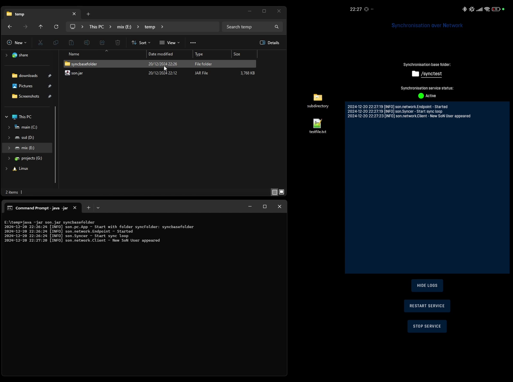

#  SoN

**S**ync **o**ver **N**etwork is a synchronisation client for PC and Android devices to keep files in a directory synchronized.

## Features
- Set the base directory 
- Synchronizes files
- Synchronizes subdirectories

## Setup for windows pc
### 1. Install a jre
You can find it [here](https://www.java.com/de/download/manual.jsp).
### 2. Download the .jar file
Please take a look at the release tab here in the repository.
### 3. Start it!
`java -jar son.jar <your_base_directory>`

## Setup for android phones
### 1. Download the app(.apk) file
Please take a look at the release tab here in the repository.
### 2. Install the app
Make sure you have allowed to install apk from an unknown source.
### 3. Start it!
The app should be self explained. You have to choose first a base folder and then you can start the service.

# Development information
This project is a java based one.
For the pc version of the app you can use for example IntelliJ IDEA, its java integration is that nice it should be enough to open the project/repo/folder and it should do the rest for you.
For the android version android studio would be the choice as well just open the project/repo/folder and it should do the rest.
